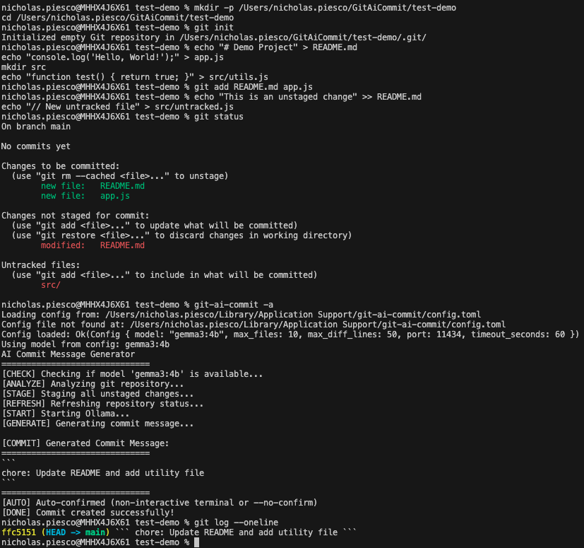

# GitAICommit

Rust-based CLI tool that generates semantically relevant commit messages using local AI models. Built with Rust, Tokio, and utilizing Ollama, it offers a privacy-focused, offline, and fast intelligent git repository analysis and AI-powered commit message generation.

[](https://www.rust-lang.org)
[](https://tokio.rs)
[](https://ollama.ai)
[](https://github.com/rust-lang/git2-rs)
[](https://clap.rs/)

## Why GitAICommit?

Writing meaningful commit messages is tedious, but crucial for maintaining a healthy codebase. GitAICommit makes it easy by:

- Generating semantic commit messages automatically
- Understanding the context of your code changes
- Supporting conventional commit standards
- Using local AI models for private offline inference
- Providing a blazingly fast, Rust-based CLI interface
- Working across all major operating systems
- Offering flexible configuration options

## Quick Start

### Prerequisites

- Rust 1.70 or later
- Git
- Ollama (for local AI models)

### Installation

```bash
# Ynstall from source
git clone https://github.com/yourusername/gitAICommit.git
cd gitAICommit
cargo install --path .
```

### Basic Usage

```bash
# Generate and commit changes with AI
git-ai-commit

# Stage all changes and generate commit message
git-ai-commit -a

# Preview commit message without committing
git-ai-commit -d

# Show verbose output
git-ai-commit -v
```

## Demo



## Command Line Options

```
USAGE:
    git-ai-commit [OPTIONS]

OPTIONS:
    -m, --model <MODEL>             AI model to use [default: gemma3:4b]
    -f, --max-files <COUNT>         Max files to include in diff [default: 10]
    -l, --max-diff-lines <LINES>    Max diff lines per file [default: 50]
    -d, --dry-run                   Show what would be committed
    -v, --verbose                   Show verbose output
    -p, --port <PORT>               Port for Ollama server [default: 11434]
    -t, --timeout <SECONDS>         Timeout for AI generation [default: 60]
    -a, --add-unstaged              Automatically stage all unstaged changes
        --confirm                   Ask for confirmation before committing
        --template <FILE>           Path to a custom prompt template file
        --list-models               List available Ollama models and exit
```

## Configuration

### Config File
Create `~/.config/git-ai-commit/config.toml`:

```toml
model = "gemma3:4b"
max_files = 15
max_diff_lines = 100
timeout_seconds = 120
confirm = true
```

### Environment Variables

```bash
# Override default model
export GIT_AI_COMMIT_MODEL=gemma3:4b

# Set custom Ollama port
export OLLAMA_HOST=http://localhost:11434
```

## Features

### AI-Powered Commit Messages
- Uses local Ollama models for privacy and offline use
- Generates semantic, conventional commit messages
- Understands code context and changes
- Supports multiple AI models
- Automatically downloads missing models

### Fast & Efficient
- Built with Rust for maximum performance
- Asynchronous I/O with Tokio
- Minimal dependencies
- Low memory footprint

### Smart Git Integration
- Analyzes staged and unstaged changes
- Understands file types and changes
- Supports partial staging
- Works with existing git workflows

## Advanced Usage

### Auto-Staging Behavior

When using the `--add-unstaged` flag, the tool will:
1. Stage all unstaged changes (including untracked files)
2. Generate a commit message based on all staged changes
3. Only proceed with the commit if there are actual changes to commit

### Model Management

The tool will automatically download the specified model if it's not already available. Supported models include:

- `gemma3:4b` (default) - Best balance of performance and quality
- `gemma3:1b` - Faster but less accurate than 4b
- `tinyllama:latest` - Very fast but less accurate

To list available models:
```bash
git-ai-commit --list-models
```

## Development

### Running Tests

```bash
# Run all tests
cargo test

# Run specific test file
cargo test --test git_info_test
cargo test --test cli_args_test
```

### Building for Release

```bash
# Build with optimizations
cargo build --release
```


## License

MIT - See [LICENSE](LICENSE) for details.

## Acknowledgments

- [Ollama](https://ollama.ai) for local AI models
- [git2-rs](https://github.com/rust-lang/git2-rs) for Git bindings
- [Clap](https://clap.rs/) for CLI parsing
- [Tokio](https://tokio.rs/) for async runtime